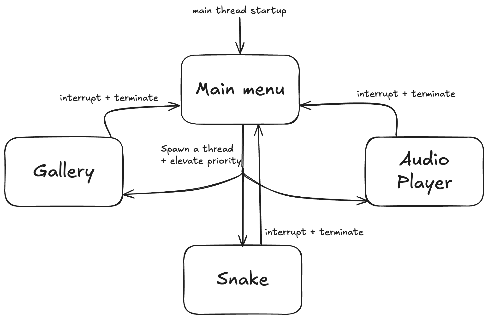

# MicroController-Media-Centre

This project is an implementation of a micro controller based media centre application, offering 3 basic applications. It is designed to use Keil's RTOS API for multithreading and priorities. It's written and demoed on the ARM Cortex-M3 processor, NXP LPC1768 chipset and MCB1700 micro-controller board.

### System Design
The following diagram gives an overview of how the media centre switches between apps.

The media centre uses threads to switch between applications, elevating priority of the current app its on. Upon exiting an app, its thread's priority is lowered or is terminated. 
